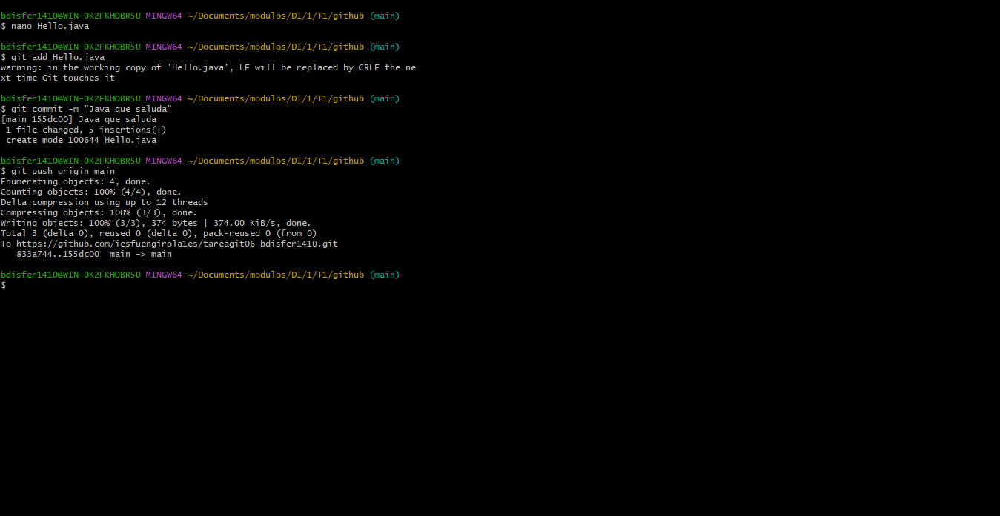
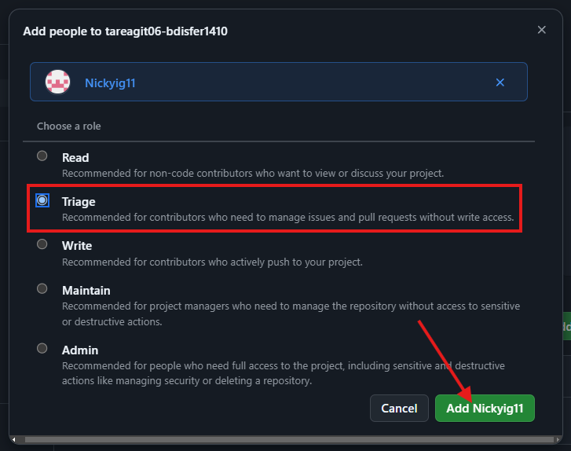
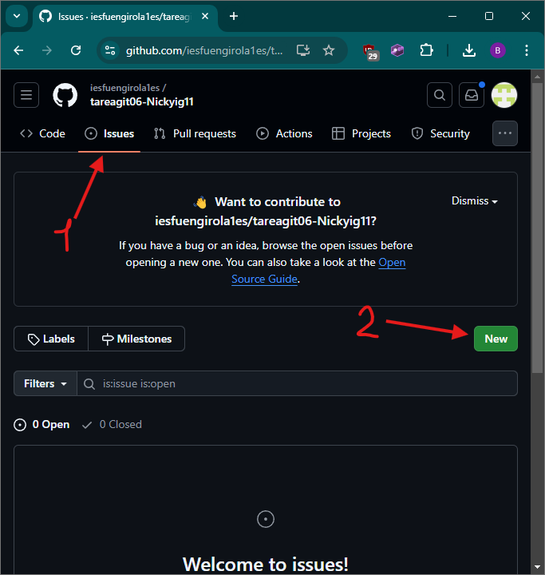
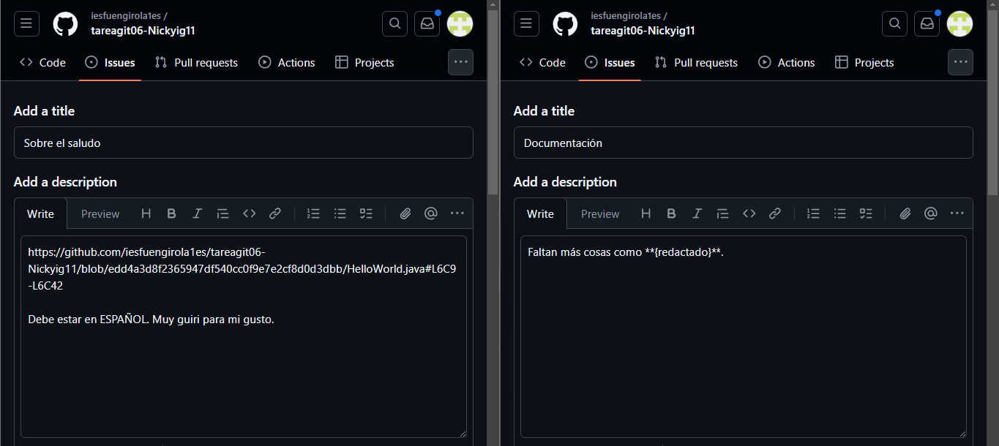
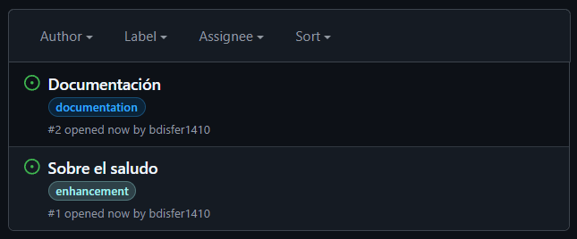
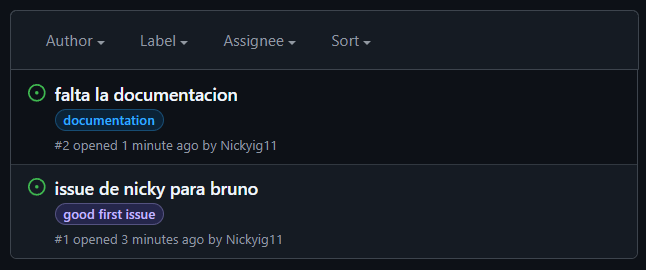
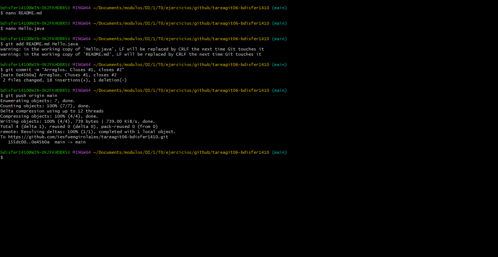
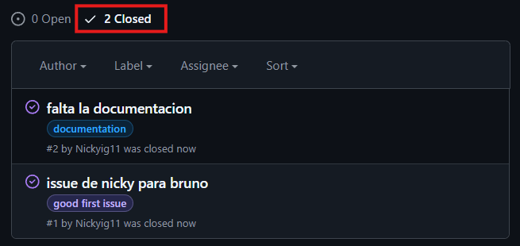

# tareagit06-bdisfer1410

# Inicialización
1.  Preparo un archivo para que mi compañero le haga un par de issues. \
    

2.  Y hablando de compañeros. Lo añado al repositorio como contribuidor de rango **Triage**.
    Esto le dará los permisos justos para poder que el **pueda etiquetar** sus issues. \
    

# Abrir Issues
1.  Me voy al repositorio de Nicky. Ahí le doy a _Issues_ y clico en **New**. \
    

2.  Creo los dos mensajes, añadiendo para cada uno: Título, contenido y labels. \
    (Para referenciar una línea de código, es: Abrir el archivo, click en el número de línea y "referene in issue") \
    

3.  Aquí vemos lo que le abrí a Nicky. \
    

# Cerrar Issues
1.  Aquí vemos las issues que me hizo el compañero. \
    

2.  Voy a mi repo desde la terminal, hago algunos cambios y los pusheo. \
    **IMPORTANTE:** El commit debe llevar al final ``Closed #{NUM}`` para cada issue a cerrar. \
    

3.  Volviendo a la pantalla del punto 1, vemos como se cerró. (Estoy en la pestaña Closed) \
    